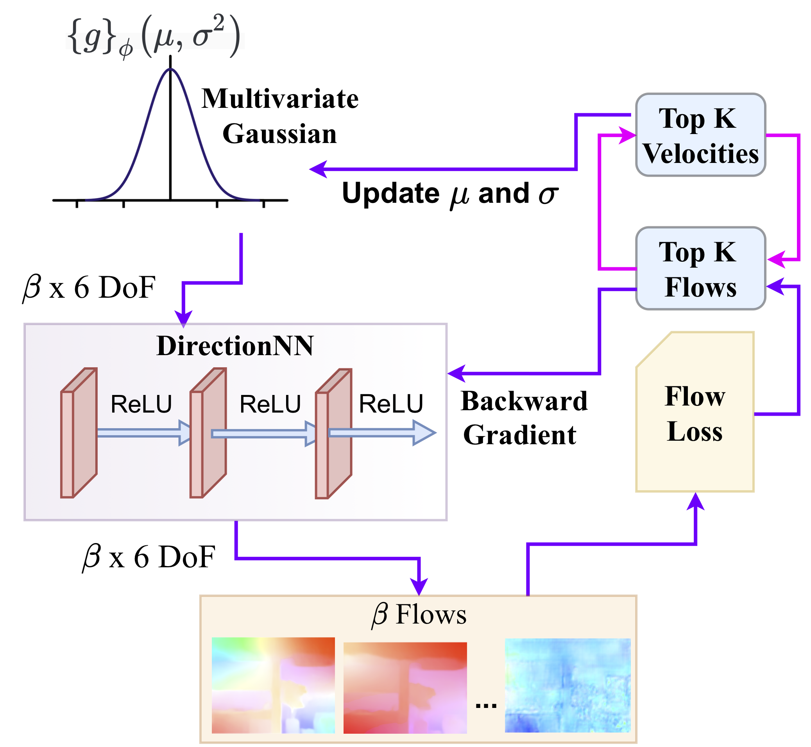

## RTVS: A Lightweight Differentiable MPC Framework For Real-Time Visual Servoing

Mohammad Nomaan Qureshi\*1, Pushkal Katara\*1, Abhinav Gupta\*1, Harit Pandya2, Y V S Harish1, AadilMehdi Sanchawala1, Gourav Kumar3, Brojeshwar Bhowmick3 and K. Madhava Krishna1

1 Robotics Research Center, IIIT Hyderabad, India   
2 Toshiba Research, Cambridge, UK   
3 TCS Research and Innovation, Kolkata, India  
* indicates equal contribution  

Coda and Dataset will be released soon!

<button name="button" onclick="https://bonjovi1.github.io/assets/pdf/RTVS.pdf">Download Paper</button>

 

### Abstract

Recent data-driven approaches to visual servoing have shown improved performances over classical methods due to precise feature matching and depth estimation. Some recent servoing approaches use a model predictive control (MPC) framework which generalise well to novel environments and are capable of incorporating dynamic constraints, but are computationally intractable in real-time, making it difficult to deploy in real-world scenarios. On the contrary, single- step methods optimise greedily and achieve high servoing rates, but lack the benefits of the MPC multi-step ahead formulation. In this paper, we make the best of both worlds and propose a lightweight visual servoing MPC framework which generates optimal control near real-time at a frequency of 10.52 Hz. This work utilises the differential cross-entropy sampling method for quick and effective control generation along with a lightweight neural network, significantly improving the servoing frequency. We also propose a novel flow normalisation layer which ameliorates the issue of inferior predictions from the flow network. We conduct extensive experimentation on the Habitat simulator and show a notable decrease in servoing time in comparison with other approaches that optimise over a time horizon. We achieve the right balance between time and performance for visual servoing in six degrees of freedom (6DoF), while retaining the advantageous MPC formulation.

 

RTVS shows a significant improvement in servoing frequency vis-à-vis other deep MPC based visual servoing approaches in 6DoF, without compromising its ability to attain precise alignments. Our controller generates optimal control in real-time at a frequency of 66 Hz (excluding optical flow overheads) and successfully servos to its destination, while other approaches still lag behind.

### Pipeline
We demonstrate our MPC based optimisation framework to perform visual servoing in 6DoF. In each MPC optimisation step, we use FlowNetC to predict the optical flow between the current image It and goal image I∗, which acts as the target flow for control generation. The flow computed between the current and previous image acts as a proxy for depth, which after normalisation, is fed into the interaction matrix. Our control generator then optimises the flow loss to generate control commands. 

This figure depicts our control generation architecture. We sample a (β x 6) vector from a multivariate Gaussian distribution and pass it through our Directional Neural Network. The kinetic model generates β pseudo-flows and the flow loss is computed for each, against the target flow. In each MPC step, we pick the top K velocities corresponding to the K least flow errors to update the Gaussian parameters, while the mean velocity is fed to the actuator.

